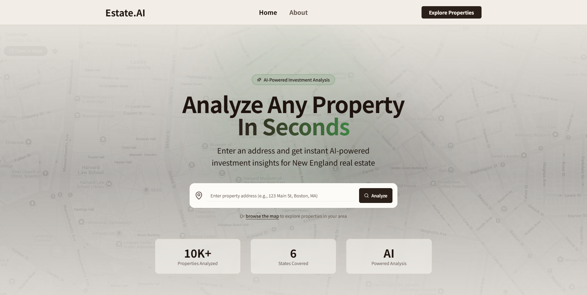

## EstateAI
**Hack@Brown 2026 FetchAI Challenge Track Winner**
*Will preface, the project is longer online due to it burning a monthly hole in my wallet*
An AI-powered real estate investment analysis platform designed specifically for New England properties, combining modern web technologies with intelligent agents to provide comprehensive property underwriting, interactive mapping, and investment insights.

### Key Features
- 🗺️ Interactive Map View - Explore properties with an intuitive Leaflet-based map interface
- 📊 Comprehensive Deal Analysis - Calculate key metrics: cash flow, ROI, cap rate, cash-on-cash returns
- 🤖 AI-Powered Insights - Property-type-specific agents (Single-Family, Multi-Family, Condo, Townhouse) provide tailored investment commentary via Fetch.ai's Agentverse
- 📈 5-Year Projections - Timeline forecasts showing equity build-up and cumulative returns
- 🎯 Risk Assessment - Automated risk scoring and timing recommendations (buy now, watch, avoid)
- 🔍 Smart Property Filtering - Filter by price, bedrooms, bathrooms, and property type
- 📋 Side-by-Side Comparisons - Compare up to 5 properties simultaneously

### What role did I play?
This project was developed during a 48 hour hackathon as a group of 4, where we did use AI-assistance to generate the initial implementation. I was mainly in charge of fixing the frontend bugs and inconsistencies while also ensure that the backend endpoints were connecting to the frontend properly. 

Afterwards, I took on the role of setting up the MongoDB connection and connecting that to the backend by hand - I didn't want to be reliant on AI :) - and afterwards helped in debugging the multi-agent workflow.
