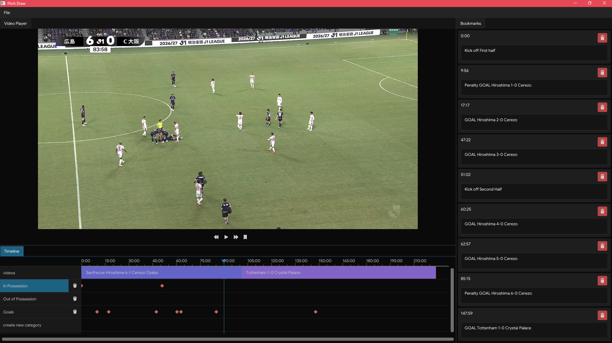

## PitchDraw
A football video analysis applcation developed in C++ and ImGui / OpenGL as a lightweight (and free) alternative to professional tools like Hudl Sportscode. It combines video playback with an interactive timeline, timestamped bookmarks, annotations, and categorized analysis, allowing users to quickly review and organize important moments from match footage.

### Why did I bother building this?
I was working on some analysis for my Sports Interactive role as a researcher and some personal opposition analysis work for fun and I realized theres nothing on the market that is both affordable and good at the functionality like PitchDraw. Specifically, I couldn't find an application which allowed users to effectively timestamp moments within the game (I always did it on notepad, jot down patterns and then find clips which support my argument, but looking for these clips take a ridiculous amount of time).

There's no publicly available github because I want to build this out while working with industry professionals who I've been in contact with. The idea for the future is that I want the application to be able to also generate tactical image overlays, player tracking and annotated clip rendering.
