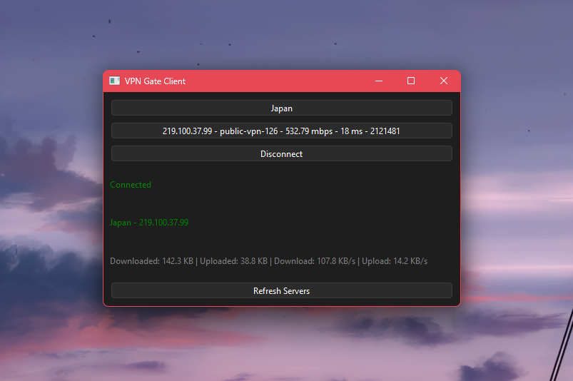

## VPN Gate Client
A desktop VPN client built with Python and the PySide6 framework to connect to 'VPN Gate' (a collection of public OpenVPN relay servers) with OpenVPN, pre-filtering by server connectivity + availability health checks and the option to manually select countries or specific servers, in one click.

### Why did I bother to build this?
It might seem far easier to just go to VPN Gate and download the individual `.ovpn` files. Even easier, use any other vpn that lets you connect with 1 click of a button (kind of like what this client is doing now).

Both points are valid, and honestly a fairly good reason not to build my own VPN client; but my client solves 2 problems that I come across that generic VPNs cannot solve. 

1. **Making the VPN be as undetectable as possible as a VPN**
2. **Lack of Server Health Check for VPN Gate**

Making the VPN be difficult to detect as a VPN was the priority; most VPNs, no matter how big the brand operating it, can be detected as a VPN fairly easily if the website you're trying to access tries hard enough to do so. *This is why I use VPN Gate.* Since they host public relay servers which are run by volunteers, **residential IPs** or server IPs which haven't been detected as VPN are able also hosted making it easy to bypass georestricted content that specifically ban VPNs.

So why not just download the `.ovpn` files straight from VPN Gate, or even better, use the SothEther VPN software they provide that basically does the same thing this client is doing? 

For one, I'm on a laptop with the ARM64 architecture and, although this wasn't really confirmed anywhere on the website, the SoftEther software just would not work no matter what I did, so I downloaded the individual `.ovpn` files for a little while. But, without any indication of which servers are online, which ones are reachable, I would occasionally have to download dozens of files before I found one that actually worked (not to mention, some of the bigger servers would be detected as a VPN and lose its purpose as a way to bypass that restriction).

Since my VPN Client does the server availability check on load, the only countries and servers able to be connected are the ones which are guaranteed to be online. Within 1 click of the button I can immediately connect to, by default, a Japanese relay server. If it doesn't work then I can change the server and reconnect in 2 clicks.
